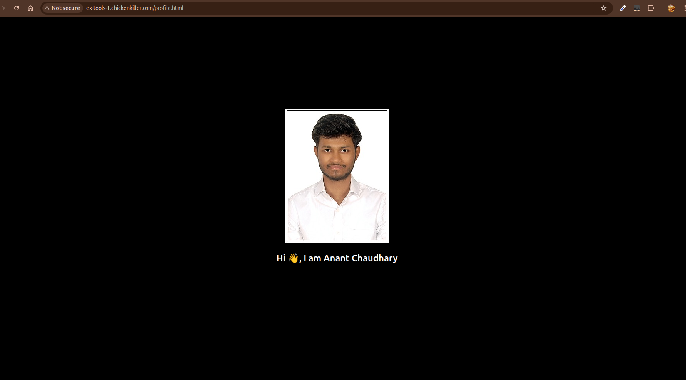
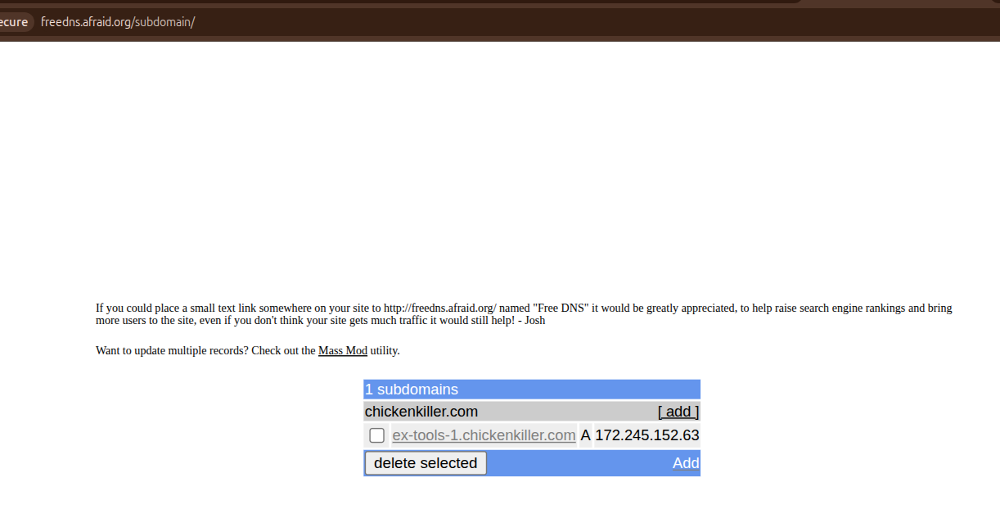
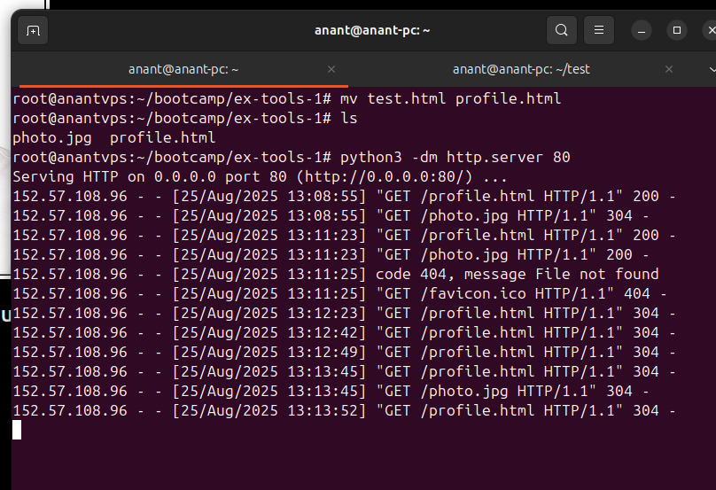

# VPS Web Server Setup - ex-tools-1

## Overview

This project demonstrates setting up a Linux VPS server in the cloud to host a simple web page as part of a devops task. The webpage displays my name and photo, serving as proof of successful server setup and domain configuration.

## Resources Used

- VPS purchased from [vpshostingservice.co](https://vpshostingservice.co)
- Free DNS domain from [afraid.org](https://afraid.org) using the domain: **chickenkiller.com**
- Created a subdomain: **ex-tools-1.chickenkiller.com**
- Served an HTML file containing my name and photo via Python’s built-in HTTP server on port 80


## Setup Steps

1. **VPS Purchase and Access**
   - Bought a Linux VPS from vpshostingservice.co.
   - Connected to the VPS server using SSH.

2. **Domain and Subdomain Configuration**
   - Registered a free domain `chickenkiller.com` from afraid.org.
   - Created a subdomain `ex-tools-1` pointing to the VPS’s public IP address.

   - Verified DNS propagation and domain pointing.

3. **Web Server Setup**
   - Uploaded a simple HTML file including my name and photo onto the VPS.
   - Started a Python HTTP server using the command:
     ```
     python3 -m http.server 80
     ```
   - The server listens on port 80 to serve the files located in the directory.

4. **Testing**
   - Accessing `http://ex-tools-1.chickenkiller.com/profile.html` opens the landing page showing my name and photo.
   - The VPS terminal confirms serving the page with HTTP status 304 (cached content served).


## Notes and Observations

- The subdomain setup at afraid.org allowed free domain management without need for credit cards.
- HTTP status 304 indicates the browser is caching the served content after initial access.

